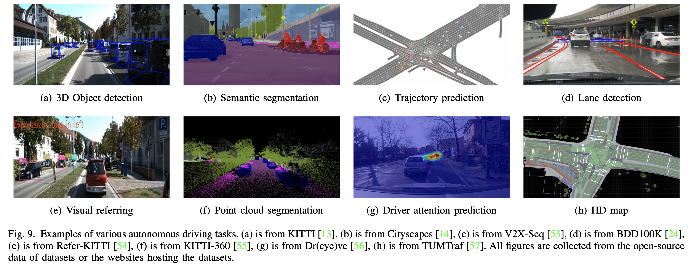
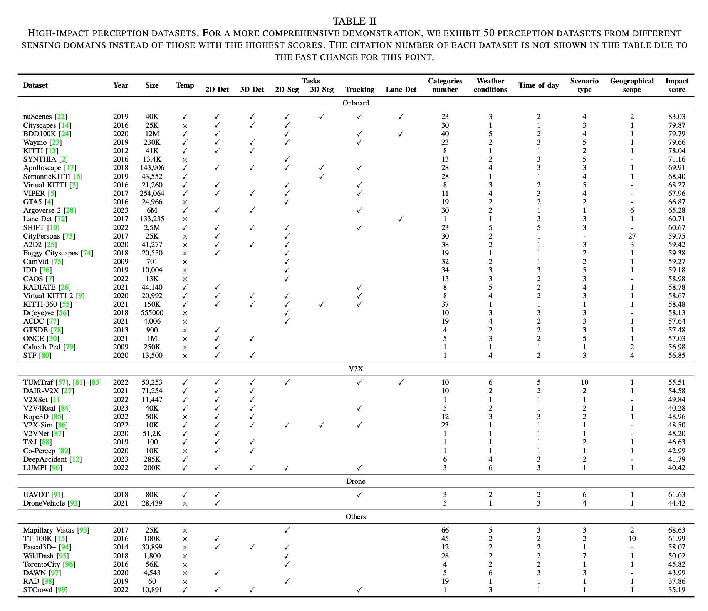
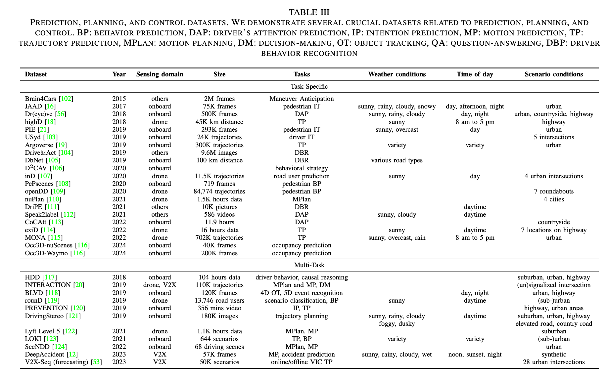
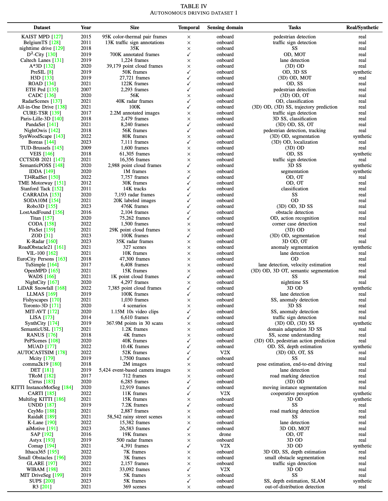
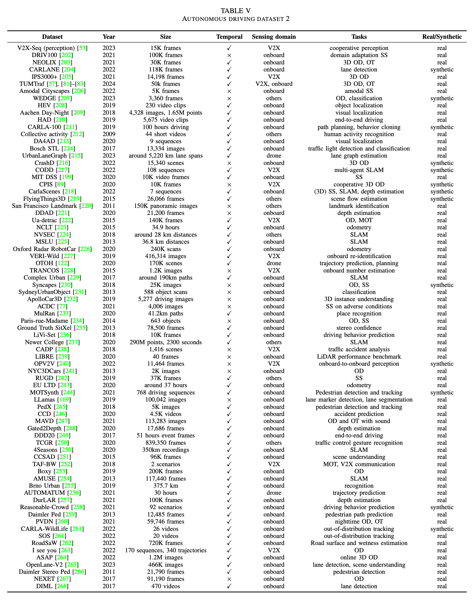
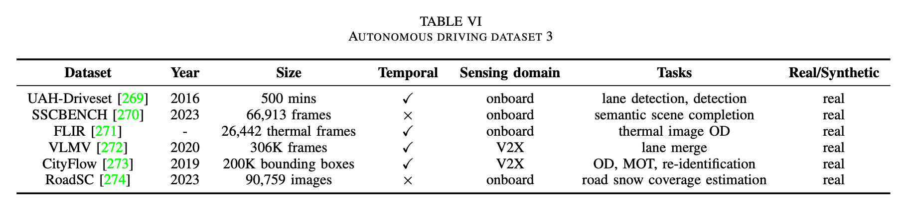
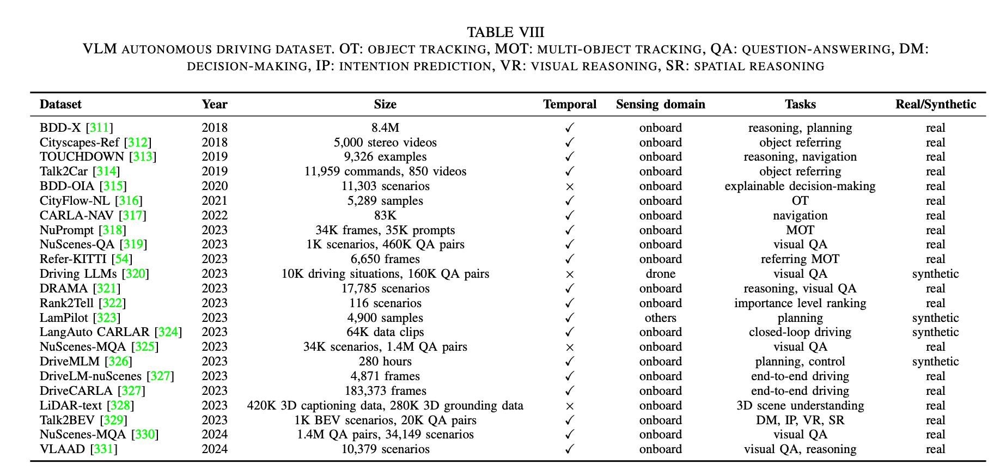

# Autonomous Driving Datasets
<div align="center">
<a href="https://arxiv.org/abs/2401.01454"></a>
<a href="https://github.com/MingyuLiu1/autonomous_driving_datasets/stargazers"></a>
<a href="https://github.com/MingyuLiu1/autonomous_driving_datasets/network/members"></a>
<a href="https://github.com/abhisheknaiidu/awesome-github-profile-readm/pulls"></a>
<a href="https://github.com/MingyuLiu1/autonomous_driving_datasets/blob/main/LICENSE"></a>
</div>

This repository collects research papers on __A Survey on Autonomous Driving Datasets: Data Statistic, Annotation, and Outlook__. The repo maintained by [TUM-AIR](https://www.ce.cit.tum.de/air/home/) will be continuously updated to track the latest work in the community. 

If there are any questions or suggestions, please feel free to reach out to mingyu.liu@tum.de). 

**Keywords: Dataset, Autonomous driving, Impact score, Annotation, Data analysis**
<p align="center">

</p>

## 🤝 &nbsp; Citation
Please visit [A Survey on Autonomous Driving Datasets: Data Statistic, Annotation, and Outlook](https://arxiv.org/pdf/2401.01454.pdf) for more details and comprehensive information. If you find our paper and repo helpful, please consider citing it as follows:

```BibTeX
@misc{liu2024survey,
      title={A Survey on Autonomous Driving Datasets: Data Statistic, Annotation, and Outlook}, 
      author={Mingyu Liu and Ekim Yurtsever and Xingcheng Zhou and Jonathan Fossaert and Yuning Cui and Bare Luka Zagar and Alois C. Knoll},
      year={2024},
      eprint={2401.01454},
      archivePrefix={arXiv},
      primaryClass={cs.CV}
}
```

## Dataset tables
<p align="center">

</p>

<p align="center">

</p>

<p align="center">

</p>

<p align="center">

</p>

<p align="center">

</p>

<p align="center">

</p>

## License

This repository is released under the [MIT license](https://github.com/MingyuLiu1/autonomous_driving_datasets/LICENSE).
