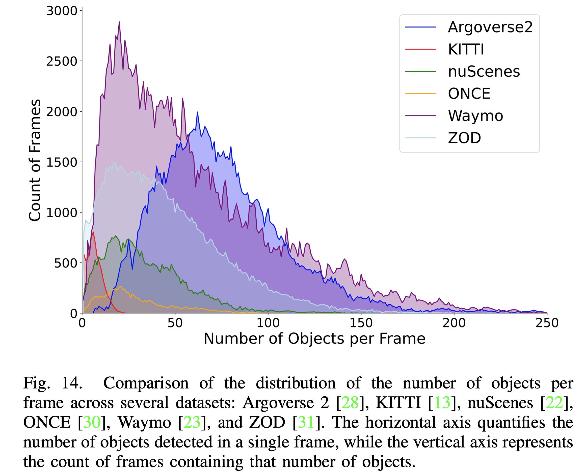

# A Survey on Autonomous Driving Datasets: Statistics, Annotation Quality, and a Future Outlook
<div align="center">
<a href="https://arxiv.org/abs/2401.01454"></a>
<a href="https://github.com/MingyuLiu1/autonomous_driving_datasets/stargazers"></a>
<a href="https://github.com/MingyuLiu1/autonomous_driving_datasets/network/members"></a>
<a href="https://github.com/abhisheknaiidu/awesome-github-profile-readm/pulls"></a>
<a href="https://github.com/MingyuLiu1/autonomous_driving_datasets/blob/main/LICENSE"></a>
</div>

This repository stores datasets mentioned in the paper __A Survey on Autonomous Driving Datasets: Statistics, Annotation Quality, and a Future Outlook__, and also provides related codes. The repo maintained by [TUM-AIR](https://www.ce.cit.tum.de/air/home/) will be continuously updated to track the latest work in the community. 

If there are any questions or suggestions, please feel free to reach out to mingyu.liu@tum.de). 

**Keywords: Dataset, Autonomous driving, Impact score, Annotation, Data analysis**
<p align="center">

</p>

<p align="center">

</p>

## ✅ News
- [29.April.2024] Our paper has been accepted by [IEEE Transactions on Intelligent Vehicles](https://ieeexplore.ieee.org/document/10509812).

## 🤝 &nbsp; Citation
Please visit [A Survey on Autonomous Driving Datasets: Data Statistic, Annotation, and Outlook](https://ieeexplore.ieee.org/document/10509812) for more details and comprehensive information. If you find our paper and repo helpful, please consider citing it as follows:

```BibTeX
@ARTICLE{10509812,
  author={Liu, Mingyu and Yurtsever, Ekim and Fossaert, Jonathan and Zhou, Xingcheng and Zimmer, Walter and Cui, Yuning and Zagar, Bare Luka and Knoll, Alois C.},
  journal={IEEE Transactions on Intelligent Vehicles}, 
  title={A Survey on Autonomous Driving Datasets: Statistics, Annotation Quality, and a Future Outlook}, 
  year={2024},
  volume={},
  number={},
  pages={1-29},
  keywords={Autonomous vehicles;Surveys;Annotations;Task analysis;Measurement;Sensors;Robot sensing systems;Dataset;impact score;data analysis;annotation quality;autonomous driving},
  doi={10.1109/TIV.2024.3394735}}
```

## Dataset tables
### Dataset tables in main paper
<p align="center">

</p>

<p align="center">

</p>

<p align="center">

</p>

### Dataset tables in supplementary
The additional datasets are collected in the [supplementary material](https://github.com/MingyuLiu1/autonomous_driving_datasets/blob/main/Supplementary.pdf).

## Statistics
We provide [codes](https://github.com/MingyuLiu1/autonomous_driving_datasets/tree/main/data_statistics) that we used to conduct statistics in our paper. You can download the neccessary .csv files by [Google Driver](https://drive.google.com/drive/folders/17LL2FEnyIYi3qJsuObDmRqB8b8yyioyk?usp=sharing).
<p>
  
  
</p>
<p>
  
  
</p>

## License
This repository is released under the [MIT license](https://github.com/MingyuLiu1/autonomous_driving_datasets/LICENSE).
